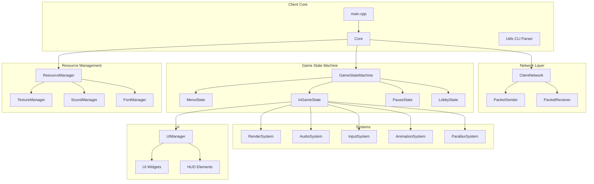

# Client Architecture

Detailed technical documentation of the R-Type client architecture.

## Overview

The client is responsible for:
- **Rendering**: Visual display of game state
- **Input handling**: Keyboard, mouse, and gamepad
- **Audio playback**: Music and sound effects
- **Network communication**: Sync with server
- **Local prediction**: Smooth gameplay despite network latency
- **UI management**: Menus and HUD

## Architecture Diagram



## Core Components

### Core Class

**File:** `client/Core.cpp`, `client/Core.hpp`

Central coordinator for the client application.

**Responsibilities:**
- Initialize all subsystems
- Manage main game loop
- Coordinate between systems
- Handle window events

**Key Methods:**
```cpp
class Core {
public:
    Core();
    ~Core();
    
    void startNetwork();              // Initialize network connection
    void initFirstScene();           // Set up initial game state
    void run();                      // Main game loop
    
    std::shared_ptr<ClientNetwork> getNetwork();
    
private:
    void processEvents();            // Handle window events
    void update(float deltaTime);    // Update game logic
    void render();                   // Draw frame
};
```

**Game Loop:**
```cpp
void Core::run() {
    sf::Clock clock;
    
    while (window->isOpen()) {
        float deltaTime = clock.restart().asSeconds();
        
        processEvents();          // Input handling
        network->receive();       // Network updates
        update(deltaTime);        // Game logic
        render();                // Draw
        
        // Frame rate limiting
        sf::sleep(sf::milliseconds(16));  // ~60 FPS
    }
}
```

### ClientNetwork

**File:** `client/ClientNetwork.cpp`, `client/ClientNetwork.hpp`

Manages all network communication with the server.

**Features:**
- UDP socket management
- Packet sending/receiving
- Connection state tracking
- Heartbeat mechanism

**Key Methods:**
```cpp
class ClientNetwork {
public:
    void connect(const std::string& ip, uint16_t port);
    void disconnect();
    
    void send(const Packet& packet);
    void receive();  // Process incoming packets
    
    bool isConnected() const;
    uint8_t getClientId() const;
    
    void setPort(uint16_t port);
    void setIp(const std::string& ip);
    void setName(const std::string& name);
    void setDebugMode(bool debug);
    
private:
    void handlePacket(const Packet& packet);
    void sendHeartbeat();
};
```

**Connection Flow:**
```cpp
// 1. Initialize network
network->setIp("127.0.0.1");
network->setPort(4242);
network->setName("Player1");

// 2. Connect to server
network->connect();

// 3. Game loop
while (running) {
    network->receive();  // Process packets
    // ... game logic
    network->send(inputPacket);  // Send player input
}

// 4. Disconnect
network->disconnect();
```

## Game State Machine

**File:** `client/gsm/GameStateMachine.cpp`

Manages different game screens and transitions.

### State Interface

```cpp
class IState {
public:
    virtual ~IState() = default;
    
    virtual void enter() = 0;      // Called when entering state
    virtual void exit() = 0;       // Called when leaving state
    virtual void update(float dt) = 0;
    virtual void render() = 0;
    virtual void handleEvent(const sf::Event& event) = 0;
};
```

### Available States

#### MenuState
- Main menu display
- Button navigation
- Option selection

#### LobbyState
- Lobby creation/joining
- Player list display
- Ready status management
- Chat system

#### InGameState
- Active gameplay
- HUD rendering
- Player controls
- Game logic

#### PauseState
- Game paused overlay
- Settings access
- Resume/quit options

### State Transitions

```cpp
class GameStateMachine {
public:
    void changeState(std::unique_ptr<IState> newState);
    void pushState(std::unique_ptr<IState> state);  // Stack states
    void popState();                                 // Return to previous
    
    void update(float deltaTime);
    void render();
    void handleEvent(const sf::Event& event);
    
private:
    std::vector<std::unique_ptr<IState>> stateStack;
};
```

**Example Usage:**
```cpp
// From menu to lobby
gsm->changeState(std::make_unique<LobbyState>());

// Pause game (stack states)
gsm->pushState(std::make_unique<PauseState>());

// Resume (pop pause state)
gsm->popState();
```

## Systems

### RenderSystem

**File:** `client/systems/rendering/RenderSystem.cpp`

Handles all visual rendering.

**Features:**
- Sprite rendering
- Layer management
- Camera/viewport
- Parallax backgrounds
- Particle effects

```cpp
class RenderSystem : public ASystem {
public:
    void update(float deltaTime) override;
    
private:
    void renderEntities();
    void renderUI();
    void renderParallax();
    void sortByLayer();
    
    std::shared_ptr<sf::RenderWindow> window;
    sf::View camera;
};
```

**Rendering Pipeline:**
```
1. Clear window
2. Set camera view
3. Render background layers (parallax)
4. Sort entities by layer
5. Render entities (sprites)
6. Render particle effects
7. Render UI (HUD)
8. Display frame
```

### InputSystem

**File:** `client/systems/input/InputSystem.cpp`

Processes user input from multiple sources.

**Supported Devices:**
- Keyboard
- Mouse
- Gamepad (Xbox, PlayStation, Generic)

```cpp
class InputSystem : public ASystem {
public:
    void update(float deltaTime) override;
    void handleEvent(const sf::Event& event);
    
    bool isActionPressed(InputAction action) const;
    Vector2D getMovementVector() const;
    
private:
    void updateKeyboard();
    void updateGamepad();
    
    InputMappingManager mappings;
    std::map<InputAction, bool> actionStates;
};
```

**Input Actions:**
```cpp
enum class InputAction {
    MoveUp,
    MoveDown,
    MoveLeft,
    MoveRight,
    Shoot,
    Special,
    Pause,
    Chat
};
```

### AudioSystem

**File:** `client/systems/audio/`

Manages music and sound effect playback.

**Components:**
- **MusicSystem**: Background music management
- **SoundSystem**: Sound effects playback

```cpp
class MusicSystem : public ASystem {
public:
    void playMusic(const std::string& musicId);
    void stopMusic();
    void setVolume(float volume);  // 0.0 - 100.0
    void setMusicVolume(float volume);
    
private:
    sf::Music currentMusic;
    std::map<std::string, std::string> musicPaths;
};

class SoundSystem : public ASystem {
public:
    void playSound(const std::string& soundId);
    void playSoundAt(const std::string& soundId, Vector2D position);
    void setSFXVolume(float volume);
    
private:
    std::vector<sf::Sound> activeSounds;
    std::map<std::string, sf::SoundBuffer> soundBuffers;
};
```

**Positional Audio:**
```cpp
// Play sound at entity position
auto transform = registry->getComponent<TransformComponent>(entity);
soundSystem->playSoundAt("explosion", {transform->x, transform->y});
```

### AnimationSystem

**File:** `client/systems/animation/AnimationSystem.cpp`

Manages sprite animations.

```cpp
class AnimationSystem : public ASystem {
public:
    void update(float deltaTime) override;
    
private:
    void updateAnimations(float deltaTime);
    void changeAnimation(Entity entity, const std::string& animName);
};
```

**AnimationComponent:**
```cpp
struct AnimationComponent : public IComponent {
    std::string currentAnim;
    int currentFrame;
    float frameTime;
    float elapsed;
    bool loop;
    
    std::map<std::string, Animation> animations;
};

struct Animation {
    std::vector<sf::IntRect> frames;
    float frameDuration;
};
```

## UI System

### UIManager

**File:** `client/ui/UIManager.cpp`

Manages all UI elements and widgets.

**Features:**
- Widget hierarchy
- Event handling
- Layout management
- Theme support

```cpp
class UIManager {
public:
    void addWidget(std::shared_ptr<Widget> widget);
    void removeWidget(const std::string& id);
    
    void update(float deltaTime);
    void render(sf::RenderWindow& window);
    void handleEvent(const sf::Event& event);
    
private:
    std::vector<std::shared_ptr<Widget>> widgets;
    std::shared_ptr<Widget> focusedWidget;
};
```

### Widget Types

#### Button
```cpp
class Button : public Widget {
public:
    void setOnClick(std::function<void()> callback);
    void setText(const std::string& text);
    void setTexture(const sf::Texture& texture);
};
```

#### TextBox
```cpp
class TextBox : public Widget {
public:
    void setText(const std::string& text);
    std::string getText() const;
    void setEditable(bool editable);
};
```

#### Slider
```cpp
class Slider : public Widget {
public:
    void setValue(float value);  // 0.0 - 1.0
    float getValue() const;
    void setOnValueChanged(std::function<void(float)> callback);
};
```

#### Label
```cpp
class Label : public Widget {
public:
    void setText(const std::string& text);
    void setFont(const sf::Font& font);
    void setColor(const sf::Color& color);
};
```

## Resource Management

### ResourceManager

**File:** `client/initResourcesManager/`

Central resource loading and caching system.

**Managed Resources:**
- Textures (PNG, JPG)
- Sounds (WAV, OGG)
- Fonts (TTF)
- Shaders (GLSL)
- Configurations (JSON)

```cpp
class ResourceManager {
public:
    static ResourceManager& getInstance();
    
    // Texture management
    sf::Texture& getTexture(const std::string& id);
    void loadTexture(const std::string& id, const std::string& path);
    
    // Sound management
    sf::SoundBuffer& getSoundBuffer(const std::string& id);
    void loadSound(const std::string& id, const std::string& path);
    
    // Font management
    sf::Font& getFont(const std::string& id);
    void loadFont(const std::string& id, const std::string& path);
    
    // Shader management
    sf::Shader& getShader(const std::string& id);
    void loadShader(const std::string& id, const std::string& vertex,
                    const std::string& fragment);
    
    void unloadAll();
    
private:
    std::map<std::string, sf::Texture> textures;
    std::map<std::string, sf::SoundBuffer> sounds;
    std::map<std::string, sf::Font> fonts;
    std::map<std::string, sf::Shader> shaders;
};
```

**Usage:**
```cpp
// Load resources
auto& rm = ResourceManager::getInstance();
rm.loadTexture("player", "assets/sprites/player.png");
rm.loadSound("shoot", "assets/sounds/shoot.wav");

// Use resources
sf::Sprite sprite(rm.getTexture("player"));
sf::Sound sound(rm.getSoundBuffer("shoot"));
```

## Client Prediction

### Local Prediction

To compensate for network latency, the client predicts player movement locally.

**Strategy:**
1. Client sends input to server
2. Client immediately applies input locally (prediction)
3. Server processes input and sends authoritative state
4. Client reconciles with server state

```cpp
void ClientNetwork::handleMovementPrediction() {
    // Apply input immediately (prediction)
    auto transform = registry->getComponent<TransformComponent>(localPlayer);
    transform->x += input.dx * deltaTime;
    transform->y += input.dy * deltaTime;
    
    // Store predicted state
    predictionHistory.push_back({frameNumber, transform->x, transform->y});
    
    // Send input to server
    sendInputPacket(input);
}

void ClientNetwork::reconcileWithServer(const ServerState& serverState) {
    auto transform = registry->getComponent<TransformComponent>(localPlayer);
    
    // Check if prediction was correct
    float errorX = abs(transform->x - serverState.x);
    float errorY = abs(transform->y - serverState.y);
    
    if (errorX > RECONCILIATION_THRESHOLD || errorY > RECONCILIATION_THRESHOLD) {
        // Correct to server state
        transform->x = serverState.x;
        transform->y = serverState.y;
        
        // Replay inputs after server frame
        replayInputs(serverState.frameNumber);
    }
}
```

### Entity Interpolation

Other entities are interpolated between received server states for smooth movement.

```cpp
void ClientNetwork::interpolateEntities(float deltaTime) {
    auto view = registry->view<TransformComponent, NetworkComponent>();
    
    for (Entity entity : view) {
        if (entity == localPlayer) continue;  // Don't interpolate local player
        
        auto transform = registry->getComponent<TransformComponent>(entity);
        auto network = registry->getComponent<NetworkComponent>(entity);
        
        // Interpolate between previous and current server state
        float alpha = network->interpolationTime / network->interpolationDelay;
        transform->x = lerp(network->prevX, network->targetX, alpha);
        transform->y = lerp(network->prevY, network->targetY, alpha);
        
        network->interpolationTime += deltaTime;
    }
}
```

## Configuration

### Settings Management

**File:** `client/SettingsManager.cpp`

Manages persistent client settings.

```cpp
class SettingsManager {
public:
    static SettingsManager& getInstance();
    
    void load();  // Load from saves/settings.json
    void save();  // Save to saves/settings.json
    
    // Graphics
    void setResolution(int width, int height);
    void setFullscreen(bool fullscreen);
    void setVSync(bool vsync);
    void setFPSLimit(int limit);
    
    // Audio
    void setMasterVolume(float volume);
    void setMusicVolume(float volume);
    void setSFXVolume(float volume);
    
    // Gameplay
    void setPlayerName(const std::string& name);
    void setAutoReconnect(bool enabled);
    
    // Getters
    int getWidth() const;
    int getHeight() const;
    bool isFullscreen() const;
    // ... etc
    
private:
    SettingsConfig config;
};
```

**Settings File Format:**
```json
{
  "graphics": {
    "resolution": {"width": 1920, "height": 1080},
    "fullscreen": false,
    "vsync": true,
    "fpsLimit": 60
  },
  "audio": {
    "masterVolume": 80,
    "musicVolume": 70,
    "sfxVolume": 85
  },
  "network": {
    "defaultServer": "127.0.0.1",
    "defaultPort": 4242,
    "autoReconnect": true
  },
  "gameplay": {
    "playerName": "Player1",
    "showFPS": false
  }
}
```

## Performance Optimization

### Frame Rate Management

```cpp
// Target frame time (60 FPS = 16.67ms)
const float TARGET_FRAME_TIME = 1.0f / 60.0f;

void Core::run() {
    sf::Clock clock;
    float accumulator = 0.0f;
    
    while (window->isOpen()) {
        float deltaTime = clock.restart().asSeconds();
        accumulator += deltaTime;
        
        // Fixed timestep for game logic
        while (accumulator >= TARGET_FRAME_TIME) {
            update(TARGET_FRAME_TIME);
            accumulator -= TARGET_FRAME_TIME;
        }
        
        // Render with interpolation
        render(accumulator / TARGET_FRAME_TIME);
    }
}
```

### Asset Streaming

Large assets loaded asynchronously:

```cpp
void ResourceManager::loadAssetsAsync() {
    std::thread([this]() {
        loadTexture("background1", "assets/bg1.png");
        loadTexture("background2", "assets/bg2.png");
        // ... more assets
    }).detach();
}
```

### Entity Culling

Only render entities in view:

```cpp
bool isInView(const TransformComponent& transform, const sf::View& view) {
    sf::FloatRect viewBounds(
        view.getCenter() - view.getSize() / 2.f,
        view.getSize()
    );
    
    return viewBounds.contains(transform.x, transform.y);
}

void RenderSystem::update(float deltaTime) {
    auto view = registry->view<TransformComponent, SpriteComponent>();
    
    for (Entity entity : view) {
        auto transform = registry->getComponent<TransformComponent>(entity);
        
        if (isInView(*transform, camera)) {
            // Render only visible entities
            renderEntity(entity);
        }
    }
}
```

## Directory Structure

```
client/
├── main.cpp                  # Entry point
├── Core.cpp/hpp              # Main game loop
├── ClientNetwork.cpp/hpp     # Network communication
├── Utils.cpp/hpp             # CLI parsing
├── constants.hpp             # Client constants
│
├── components/               # Client-specific components
│   ├── SpriteComponent.hpp
│   ├── AnimationComponent.hpp
│   └── CameraComponent.hpp
│
├── gsm/                      # Game State Machine
│   ├── GameStateMachine.cpp
│   └── states/
│       ├── MenuState.cpp
│       ├── LobbyState.cpp
│       ├── InGameState.cpp
│       └── PauseState.cpp
│
├── systems/                  # Client systems
│   ├── rendering/
│   │   ├── RenderSystem.cpp
│   │   ├── ParallaxSystem.cpp
│   │   └── AnimationSystem.cpp
│   ├── audio/
│   │   ├── MusicSystem.cpp
│   │   └── SoundSystem.cpp
│   └── input/
│       └── InputSystem.cpp
│
├── ui/                       # User interface
│   ├── UIManager.cpp
│   ├── Widget.cpp
│   └── widgets/
│       ├── Button.cpp
│       ├── TextBox.cpp
│       └── Slider.cpp
│
├── initResourcesManager/     # Resource management
│   └── ResourceManager.cpp
│
└── packet/                   # Packet handling
    ├── ClientSentPacket.cpp
    └── ClientReceivedPacket.cpp
```

## See Also

- [Client User Guide](./user-guide.md)
- [Server Architecture](../SERVER/server-intro.md)
- [Network Protocol](../NETWORK/network-intro.md)
- [ECS Documentation](../ECS/ecs-intro.md)
