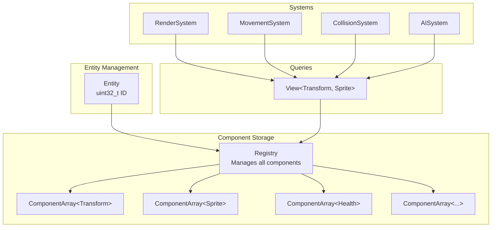

# R-Type ECS (Entity-Component-System)

## Overview

The R-Type project implements a custom **Entity-Component-System (ECS)** architecture, a powerful design pattern that separates game entities into three distinct concepts:

- **Entities**: Unique identifiers (simple integers) representing game objects
- **Components**: Pure data containers that define entity properties
- **Systems**: Logic processors that operate on entities with specific components

This architecture provides excellent performance, flexibility, and maintainability for game development.

## Why ECS?

### Traditional Object-Oriented vs ECS

**Traditional OOP Approach:**
```cpp
class Enemy : public GameObject {
    Vector2D position;
    Sprite sprite;
    Health health;
    AI ai;
    
    void update() {
        // Mixed logic for rendering, AI, physics...
    }
};
```

**ECS Approach:**
```cpp
// Entity is just an ID
Entity enemy = registry->createEntity();

// Add components (pure data)
registry->addComponent(enemy, std::make_shared<TransformComponent>(x, y));
registry->addComponent(enemy, std::make_shared<SpriteComponent>(texture));
registry->addComponent(enemy, std::make_shared<HealthComponent>(100));
registry->addComponent(enemy, std::make_shared<AIComponent>());

// Systems process entities
MovementSystem->update();  // Operates on Transform + Velocity
RenderSystem->update();    // Operates on Transform + Sprite
AISystem->update();        // Operates on AI + Transform
```

### Benefits of ECS

1. **Separation of Concerns**: Data (components) is separated from logic (systems)
2. **Composition over Inheritance**: Build entities by composing components
3. **Cache-Friendly**: Components stored contiguously in memory
4. **Flexible**: Easy to add/remove components at runtime
5. **Reusable**: Systems work with any entity that has required components
6. **Testable**: Systems can be tested independently

## Architecture Overview



## Core Concepts

### Entities

An entity is simply a unique identifier (a `size_t` integer) that serves as an index into component arrays.

```cpp
namespace ecs {
    using Entity = size_t;
}

// Creating an entity
Entity player = registry->createEntity();  // Returns: 1
Entity enemy = registry->createEntity();   // Returns: 2
```

### Components

Components are pure data structures that inherit from `IComponent`. They contain no logic, only state.

**Example Components:**

```cpp
// Position in 2D space
class TransformComponent : public IComponent {
public:
    float x, y;
    float rotation;
    
    TransformComponent(float x = 0, float y = 0, float rot = 0)
        : x(x), y(y), rotation(rot) {}
};

// Visual representation
class SpriteComponent : public IComponent {
public:
    std::string texturePath;
    int width, height;
    sf::Sprite sprite;
};

// Health and damage
class HealthComponent : public IComponent {
public:
    int currentHealth;
    int maxHealth;
    
    bool isDead() const { return currentHealth <= 0; }
};
```

### Systems

Systems contain the game logic and operate on entities that have specific components.

```cpp
class MovementSystem : public ASystem {
public:
    void update(float deltaTime) override {
        // Get all entities with Transform and Velocity components
        auto view = registry->view<TransformComponent, VelocityComponent>();
        
        for (Entity entity : view) {
            auto transform = registry->getComponent<TransformComponent>(entity);
            auto velocity = registry->getComponent<VelocityComponent>(entity);
            
            // Update position based on velocity
            transform->x += velocity->vx * deltaTime;
            transform->y += velocity->vy * deltaTime;
        }
    }
};
```

### Registry

The `Registry` is the central hub that manages all entities and components.

**Key Responsibilities:**
- Create and destroy entities
- Add, remove, and query components
- Provide views for system iteration
- Thread-safe operations with mutex

```cpp
auto registry = std::make_shared<Registry>();

// Entity lifecycle
Entity entity = registry->createEntity();
registry->destroyEntity(entity);

// Component management
registry->addComponent<TransformComponent>(entity, 
    std::make_shared<TransformComponent>(100, 200));
auto transform = registry->getComponent<TransformComponent>(entity);
bool hasTransform = registry->hasComponent<TransformComponent>(entity);
registry->removeAllComponents<TransformComponent>(entity);
```

## Component Types

R-Type categorizes components into several types:

### Permanent Components
Components that persist throughout entity lifetime:
- `TransformComponent`: Position, rotation, scale
- `SpriteComponent`: Visual representation
- `VelocityComponent`: Movement speed
- `HealthComponent`: Hit points
- `ColliderComponent`: Collision bounds
- `OwnerComponent`: Entity ownership (for bullets, etc.)

### Tags
Lightweight components used for filtering:
- `PlayerTag`: Marks player entities
- `EnemyTag`: Marks enemy entities
- `BulletTag`: Marks projectile entities
- `LocalPlayerTag`: Marks the local player on client

### Temporary Components
Short-lived components for inter-system communication:
- `DamageToApplyComponent`: Queued damage
- `DestroyEntityComponent`: Mark for deletion

### Network Components
Components used for multiplayer synchronization:
- `NetworkComponent`: Network sync state
- `NetworkOwnerComponent`: Entity ownership across network

## View System

Views provide efficient iteration over entities with specific component combinations.

```cpp
// Iterate entities with Transform AND Sprite
auto view = registry->view<TransformComponent, SpriteComponent>();

for (Entity entity : view) {
    auto transform = registry->getComponent<TransformComponent>(entity);
    auto sprite = registry->getComponent<SpriteComponent>(entity);
    
    // Render sprite at transform position
    sprite->sprite.setPosition(transform->x, transform->y);
    window.draw(sprite->sprite);
}
```

**View Benefits:**
- Only iterates entities with ALL requested components
- Efficient filtering at query time
- No temporary allocations
- Cache-friendly iteration

## Design Pattern: Component-Driven

R-Type uses a **Component-Driven** ECS pattern, chosen after evaluating multiple approaches through POCs.

### Inter-System Communication

Systems communicate through temporary components rather than direct calls:

```cpp
// CollisionSystem detects collision and adds damage component
if (collision detected) {
    registry->addComponent<DamageToApplyComponent>(entity,
        std::make_shared<DamageToApplyComponent>(10));
}

// DamageSystem processes all pending damage
auto damageView = registry->view<HealthComponent, DamageToApplyComponent>();
for (Entity entity : damageView) {
    auto health = registry->getComponent<HealthComponent>(entity);
    auto damage = registry->getComponent<DamageToApplyComponent>(entity);
    
    health->currentHealth -= damage->damage;
    
    // Remove processed damage component
    registry->removeOneComponent<DamageToApplyComponent>(entity);
}
```

**Advantages:**
- Loose coupling between systems
- Easy to add new effects
- Clear data flow
- Supports command buffer pattern

## Tags/Filters Optimization

R-Type complements the component-driven approach with tags for performance:

```cpp
// Only process enemy entities
auto enemyView = registry->view<TransformComponent, HealthComponent, EnemyTag>();

for (Entity enemy : enemyView) {
    // Process only enemies, ignore players
}
```

## Thread Safety

The Registry uses a recursive mutex to ensure thread-safe operations:

```cpp
template <typename T>
void Registry::addComponent(Entity entityId, std::shared_ptr<T> component) {
    std::lock_guard<std::recursive_mutex> lock(_mutex);
    // Thread-safe component addition
}
```

**Best Practices:**
- Systems can read components in parallel for disjoint sets
- Writes should use command buffers or be serialized
- Avoid modifying entity list while iterating (use views)

## Entity Factory

The `EntityFactory` provides convenient methods to create common entity types:

```cpp
class EntityFactory {
public:
    static Entity createPlayer(Registry& registry, float x, float y);
    static Entity createEnemy(Registry& registry, const std::string& type);
    static Entity createBullet(Registry& registry, Entity owner);
    static Entity createPowerUp(Registry& registry, const std::string& type);
};
```

## Prefab System

Prefabs define entity templates loaded from JSON configuration files:

```json
{
  "name": "basic_enemy",
  "components": {
    "transform": {"x": 0, "y": 0},
    "sprite": {"texture": "enemy.png"},
    "health": {"maxHealth": 50},
    "velocity": {"vx": -100, "vy": 0},
    "collider": {"width": 32, "height": 32}
  }
}
```

```cpp
// Create entity from prefab
Entity enemy = PrefabManager::instantiate(registry, "basic_enemy");
```

## Best Practices

### DO ✅

```cpp
// Keep components simple (data only)
class PositionComponent {
    float x, y;
};

// Use views for efficient iteration
auto view = registry->view<Transform, Velocity>();

// Use tags for filtering
registry->addComponent<EnemyTag>(entity);

// Use temporary components for communication
registry->addComponent<DamageToApplyComponent>(entity, damage);
```

### DON'T ❌

```cpp
// Don't add logic to components
class PositionComponent {
    void update() { /* NO! */ }
};

// Don't modify entity list while iterating
for (Entity e : view) {
    registry->destroyEntity(e);  // WRONG! Use command buffer
}

// Don't store entity references long-term
Entity* storedEntity = &myEntity;  // Dangerous if entity is destroyed
```

## Performance Considerations

### Memory Layout

Components are stored in contiguous arrays per type:
```
ComponentArray<Transform>: [Transform1][Transform2][Transform3]...
ComponentArray<Sprite>:    [Sprite1   ][Sprite2   ][Sprite3   ]...
```

**Benefits:**
- Cache-friendly iteration
- Predictable memory access patterns
- Efficient batch processing

### System Execution Order

Systems run in a defined order each frame:
```cpp
1. InputSystem
2. ScriptingSystem (Lua behaviors)
3. MovementSystem
4. CollisionSystem
5. DamageSystem
6. AISystem
7. AnimationSystem
8. RenderSystem
9. NetworkSyncSystem
```

## Next Steps

- **[ECS API Reference](./api.md)**: Detailed API documentation
- **[POC Documentation](../POCS/ecs/pocs-ecs.md)**: ECS pattern evaluation
- **[System Examples](../INTRO/project_architecure.md#ecs-entity-component-system-architecture)**: Concrete system implementations

---

The ECS architecture is the foundation of R-Type's game logic, providing the flexibility and performance needed for a fast-paced multiplayer shooter.
