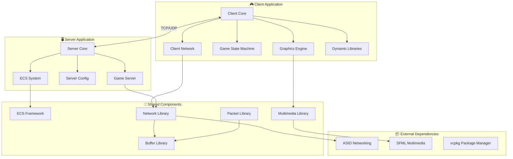
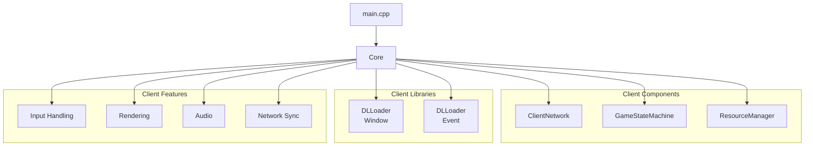
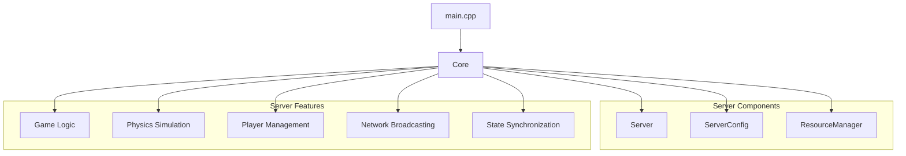
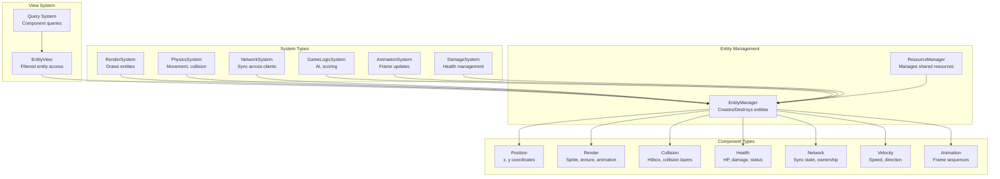
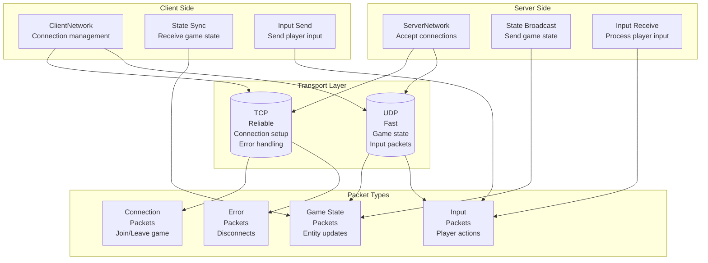
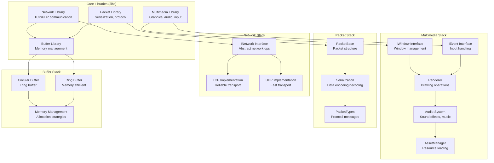
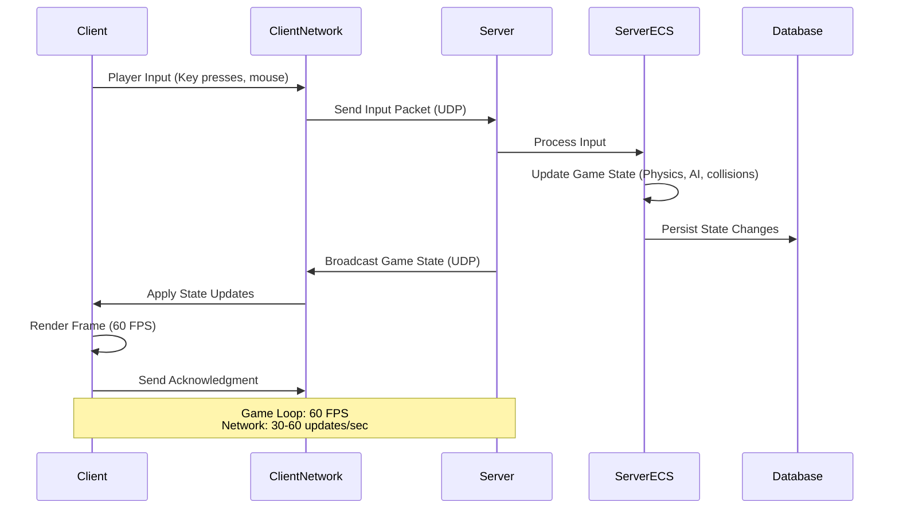
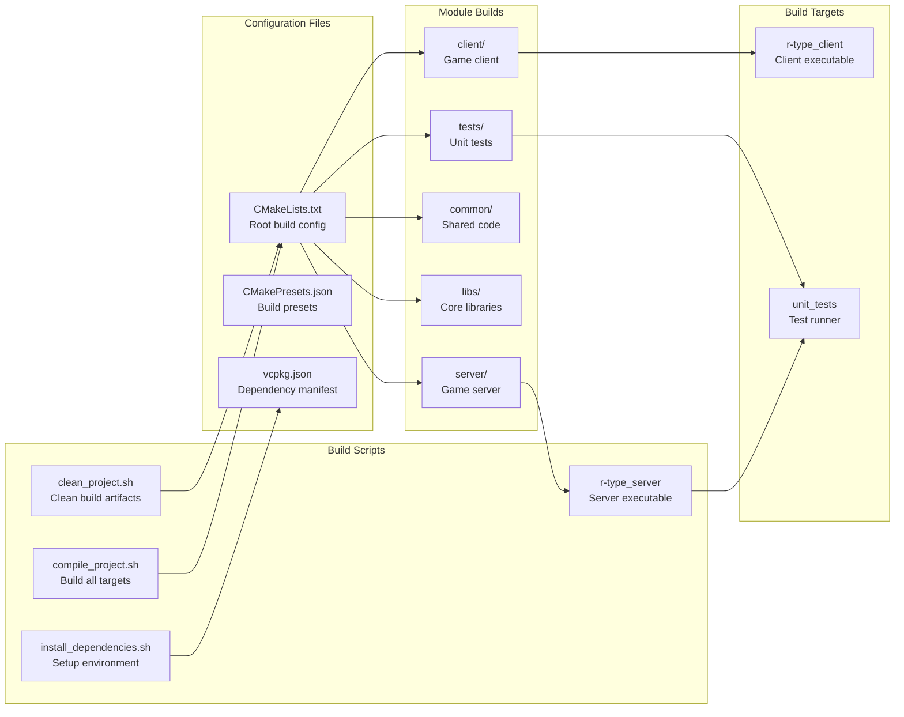
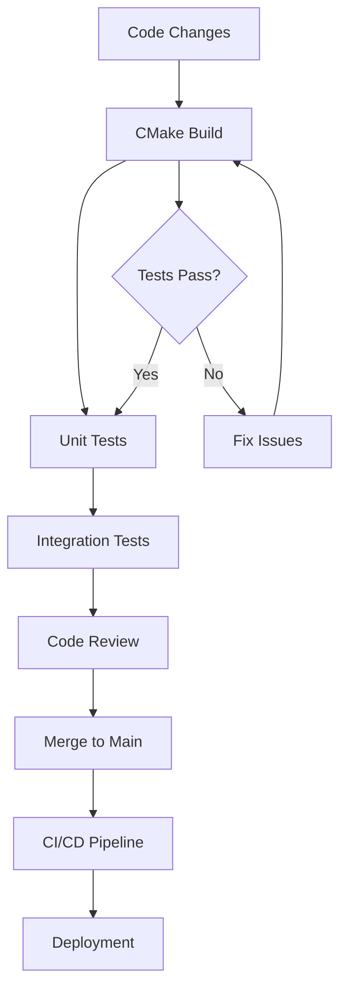

# R-Type Project Architecture

This document provides a comprehensive overview of the R-Type project's architecture, including its modular design, component relationships, and design patterns.

## Overview

R-Type is a multiplayer 2D space shooter game built with modern C++20, featuring a client-server architecture with an Entity-Component-System (ECS) design pattern. The project emphasizes modularity, performance, and cross-platform compatibility.


## High-Level Architecture



## Core Module Structure

### Client Architecture



### Server Architecture



## ECS (Entity-Component-System) Architecture



## Network Architecture



## Library Dependencies



## Data Flow Architecture



## Build System Architecture



## Design Patterns Used

| Pattern | Purpose | Location | Implementation |
|---------|---------|----------|----------------|
| **ECS** | Game object composition and management | `/common/ECS/` | Entity-Component-System architecture |
| **Strategy** | Platform-specific implementations | `/libs/Multimedia/` | Interface-based polymorphism |
| **Observer** | Event handling and notifications | `/common/Signal/` | Signal-slot pattern |
| **Factory** | Entity and prefab creation | `/common/Prefab/` | Centralized object creation |
| **Dynamic Loading** | Runtime library loading | `/common/DLLoader/` | Plugin system for multimedia |
| **Singleton** | Global resource management | Various | Resource managers, configs |
| **Command** | Input handling and replay | Client input system | Input buffering |
| **State** | Game state management | `/client/gsm/` `/server/gsm/` | State machine pattern |

## Directory Structure

```
ryanR-type/
├── client/                    # 🎮 Client application
│   ├── main.cpp              # Application entry point
│   ├── Core.hpp/cpp          # Main client logic
│   ├── ClientNetwork.hpp/cpp # Network communication
│   ├── Utils.hpp/cpp         # Client utilities
│   ├── gsm/                  # Game state machine
│   └── initRessourcesManager/# Resource initialization
├── server/                    # 🖥️ Server application
│   ├── main.cpp              # Server entry point
│   ├── Core.hpp/cpp          # Server core logic
│   ├── Server.hpp/cpp        # Server implementation
│   ├── ServerConfig.hpp/cpp  # Configuration management
│   ├── Utils.hpp/cpp         # Server utilities
│   ├── gsm/                  # Server state machine
│   └── initRessourcesManager/# Server resource init
├── common/                    # 🔧 Shared components
│   ├── ECS/                  # Entity-Component-System
│   │   ├── component/        # Component definitions
│   │   ├── entity/           # Entity management
│   │   ├── system/           # System implementations
│   │   ├── view/             # Entity querying
│   │   └── resourceManager/  # Resource management
│   ├── DLLoader/             # Dynamic library loading
│   ├── Error/                # Error handling system
│   ├── Prefab/               # Object factories
│   ├── Signal/               # Event system
│   ├── constants.hpp         # Global constants
│   └── types/                # Common type definitions
├── libs/                     # 📚 Core libraries
│   ├── Network/              # Network communication
│   ├── Multimedia/           # Graphics, audio, input
│   ├── Packet/               # Data serialization
│   └── Buffer/               # Memory management
├── assets/                   # 🎨 Game assets
│   ├── fonts/                # Font files
│   └── sprites/              # Sprite images
├── tests/                    # 🧪 Testing framework
│   ├── client/               # Client tests
│   ├── server/               # Server tests
│   └── common/               # Shared tests
├── documentation/            # 📖 Project documentation
│   └── docusaurus/           # Docusaurus site
├── scripts/                  # ⚙️ Build and utility scripts
│   ├── compile_project.sh    # Build script
│   ├── install_dependencies.sh # Dependency setup
│   ├── clean_project.sh      # Clean build
│   ├── run_unit_tests.sh     # Test runner
│   └── generate_doc.sh       # Documentation generation
├── CMakeLists.txt            # Root CMake configuration
├── CMakePresets.json         # CMake build presets
├── vcpkg.json               # vcpkg dependency manifest
└── README.md                # Project documentation
```

## Key Architectural Principles

### ✅ **Modularity**
- Clear separation between client, server, and shared components
- Interface-based design for platform abstraction
- Plugin architecture for multimedia backends

### ✅ **Performance**
- ECS architecture for efficient game loop execution
- Data-oriented design for cache-friendly memory access
- Network optimization with TCP/UDP protocol selection

### ✅ **Maintainability**
- Consistent coding standards and comprehensive testing
- Clear dependency management with vcpkg
- Modular build system with CMake

### ✅ **Scalability**
- Plugin-based architecture for extensibility
- Efficient memory management with custom buffer systems
- Network architecture supporting multiple clients

### ✅ **Cross-Platform Compatibility**
- CMake build system for multiple platforms
- Dynamic library loading for platform-specific implementations
- vcpkg for dependency management across platforms

### ✅ **Reliability**
- Comprehensive error handling system
- Unit testing framework
- Network error recovery and state synchronization

## Development Workflow



## Performance Characteristics

- **Target FPS**: 60 FPS for client rendering
- **Network Update Rate**: 30-60 updates per second
- **Latency Target**: < 100ms end-to-end
- **Memory Usage**: Optimized for low-end hardware
- **Platform Support**: Windows, Linux, macOS

## Security Considerations

- **Network Protocol**: Custom binary protocol for efficiency
- **Input Validation**: Server-side validation of all client inputs
- **Resource Limits**: Prevention of resource exhaustion attacks
- **State Synchronization**: Server authoritative game state

This architecture provides a solid foundation for a scalable, maintainable, and performant multiplayer game while following modern software engineering practices.
