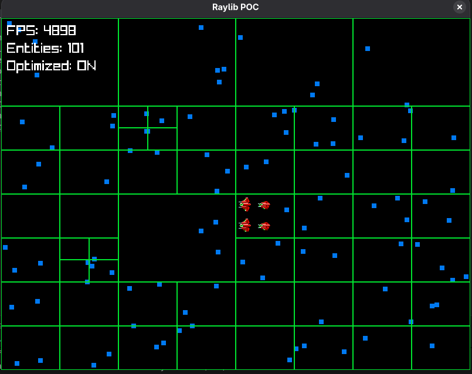

# Graphics POC – Raylib

## Overview
Raylib is a simple and easy-to-use library for videogames programming. This POC demonstrates basic 2D rendering capabilities with Raylib's straightforward API designed for rapid prototyping.

## Implementation Details
- **Library**: Raylib
- **Key Features**: Window initialization, texture loading, 2D drawing functions
- **Build System**: Makefile with Raylib linking
- **Platform**: Cross-platform (Linux/Windows tested)

## Code Snippets
```cpp
#include "raylib.h"

int main() {
    // Initialize window
    InitWindow(800, 600, "Raylib POC");
    SetTargetFPS(60);

    // Load texture
    Texture2D texture = LoadTexture("sprite.png");

    // Main game loop
    while (!WindowShouldClose()) {
        // Update
        // (Game logic here)

        // Draw
        BeginDrawing();
        ClearBackground(RAYWHITE);
        DrawTexture(texture, 100, 100, WHITE);
        EndDrawing();
    }

    // Cleanup
    UnloadTexture(texture);
    CloseWindow();

    return 0;
}
```



## Evaluation Criteria

### Ease of Use
- Extremely simple and straightforward
- Minimal API to learn
- Quick to get started

### Performance
- Good performance for simple games
- Optimized for 2D rendering
- Lightweight library

### Features
- Sufficient for basic 2D games
- 3D support available
- Audio and input handling

### Cross-platform Support
- Good cross-platform support
- Consistent API across platforms
- Focus on desktop platforms

### Integration
- Clean C API
- Easy to integrate
- Manual resource management
- **Requires encapsulation** for proper C++ integration (RAII wrappers needed)

### Community and Documentation
- Growing community
- Good documentation and examples
- Active development

### Licensing
- zlib/libpng license (permissive open-source)

## Pros
- Very easy to learn and use
- Fast prototyping capabilities
- Lightweight and focused
- Good for small projects

## Cons
- Limited advanced features
- Less mature than established libraries
- Smaller community
- May require additional libraries for complex needs
- **Requires encapsulation** for clean C++ integration

## Conclusion
Raylib excels at simplicity and rapid prototyping, making it ideal for small projects or learning purposes. However, it may lack some advanced features needed for larger, more complex game projects, and would require encapsulation for clean C++ integration.