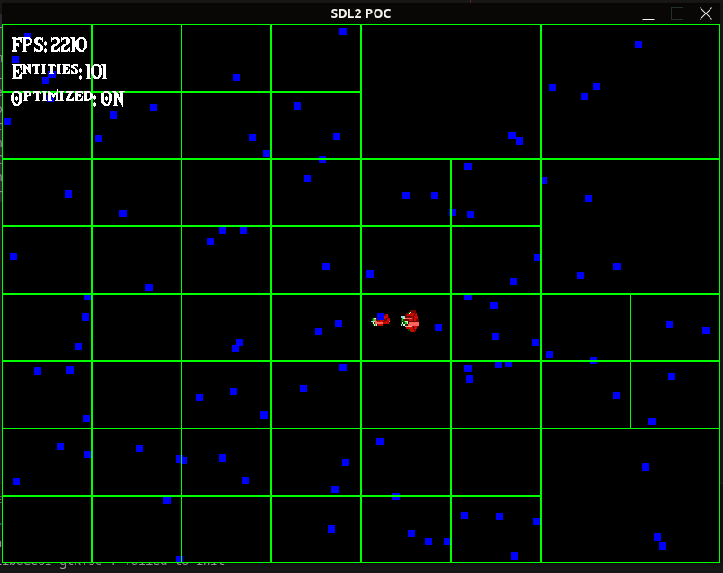

# Graphics POC – SDL2

## Overview
SDL2 (Simple DirectMedia Layer) is a cross-platform development library providing low-level access to audio, keyboard, mouse, joystick, and graphics hardware. This POC demonstrates basic 2D rendering using SDL2's rendering API.

## Implementation Details
- **Library**: SDL2
- **Key Features**: Window creation, renderer setup, surface/texture loading, basic drawing
- **Build System**: Makefile with SDL2 linking
- **Platform**: Cross-platform (Linux/Windows tested)

## Code Snippets
```cpp
#include <SDL2/SDL.h>

int main(int argc, char* argv[]) {
    SDL_Init(SDL_INIT_VIDEO);

    // Create window and renderer
    SDL_Window* window = SDL_CreateWindow("SDL2 POC",
                                        SDL_WINDOWPOS_UNDEFINED,
                                        SDL_WINDOWPOS_UNDEFINED,
                                        800, 600, 0);
    SDL_Renderer* renderer = SDL_CreateRenderer(window, -1, 0);

    // Load texture
    SDL_Surface* surface = SDL_LoadBMP("sprite.bmp");
    SDL_Texture* texture = SDL_CreateTextureFromSurface(renderer, surface);
    SDL_FreeSurface(surface);

    // Main loop
    SDL_bool running = SDL_TRUE;
    while (running) {
        SDL_Event event;
        while (SDL_PollEvent(&event)) {
            if (event.type == SDL_QUIT)
                running = SDL_FALSE;
        }

        // Clear, copy texture, present
        SDL_RenderClear(renderer);
        SDL_RenderCopy(renderer, texture, NULL, NULL);
        SDL_RenderPresent(renderer);
    }

    // Cleanup
    SDL_DestroyTexture(texture);
    SDL_DestroyRenderer(renderer);
    SDL_DestroyWindow(window);
    SDL_Quit();

    return 0;
}
```



## Evaluation Criteria

### Ease of Use
- C API can feel verbose
- Manual memory management required
- More boilerplate than modern libraries

### Performance
- Very good low-level performance
- Direct hardware access
- Minimal overhead

### Features
- Comprehensive hardware access
- Strong for complex applications
- Extensible through extensions

### Cross-platform Support
- Excellent cross-platform support
- Consistent behavior across platforms
- Wide range of supported systems

### Integration
- Pure C API, works with any language
- Manual resource management
- No exceptions, error codes
- **Requires encapsulation** for proper C++ integration (RAII wrappers needed)

### Community and Documentation
- Large community and ecosystem
- Good documentation available
- Many extensions and bindings

### Licensing
- zlib license (permissive open-source)

## Pros
- Maximum performance and control
- Excellent cross-platform support
- Large ecosystem of extensions
- Language agnostic

## Cons
- Verbose C API
- Manual memory management
- Steeper learning curve
- More code for basic tasks
- **Requires encapsulation** for clean C++ integration

## Conclusion
SDL2 is a powerful low-level library suitable for applications requiring fine-grained control over hardware. While capable, it requires more boilerplate code than higher-level alternatives for basic 2D rendering tasks, and would need encapsulation for proper C++ integration.