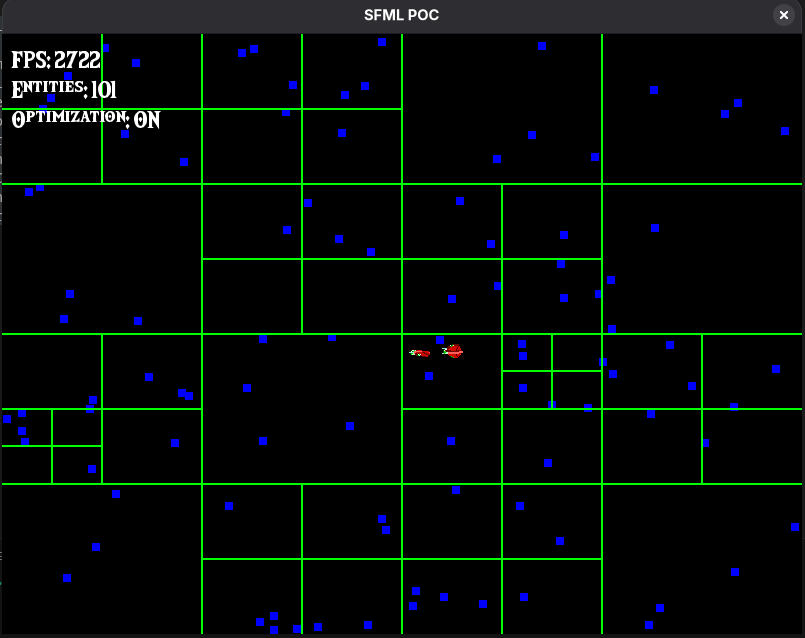

# Graphics POC – SFML

## Overview
SFML (Simple and Fast Multimedia Library) is a modern, object-oriented multimedia library for C++. This POC demonstrates basic 2D rendering capabilities including window creation, texture loading, sprite drawing, and event handling.

## Implementation Details
- **Library**: SFML 2.x
- **Key Features**: Window management, 2D rendering, texture loading, sprite manipulation
- **Build System**: Makefile with SFML linking
- **Platform**: Cross-platform (Linux/Windows tested)

## Code Snippets
```cpp
#include <SFML/Graphics.hpp>

int main() {
    // Create window
    sf::RenderWindow window(sf::VideoMode(800, 600), "SFML POC");

    // Load texture and create sprite
    sf::Texture texture;
    texture.loadFromFile("sprite.png");
    sf::Sprite sprite(texture);
    sprite.setPosition(100, 100);

    // Main game loop
    while (window.isOpen()) {
        sf::Event event;
        while (window.pollEvent(event)) {
            if (event.type == sf::Event::Closed)
                window.close();
        }

        // Clear, draw, display
        window.clear();
        window.draw(sprite);
        window.display();
    }

    return 0;
}
```



## Evaluation Criteria

### Ease of Use
- Very intuitive object-oriented API
- Clear class hierarchy (Window, Texture, Sprite)
- Minimal boilerplate code

### Performance
- Good performance for 2D games
- Hardware acceleration support
- Efficient resource management

### Features
- Comprehensive 2D graphics support
- Audio, networking, and system modules
- Shader support for advanced effects

### Cross-platform Support
- Native Linux and Windows support
- Additional platforms (Android, iOS, consoles)

### Integration
- Clean C++ integration
- RAII resource management
- Exception-based error handling

### Community and Documentation
- Excellent official documentation
- Active community and tutorials
- Regular updates and maintenance

### Licensing
- zlib/libpng license (permissive open-source)

## Pros
- Modern C++ API with RAII
- Complete multimedia library
- Excellent documentation
- Active development
- Cross-platform consistency

## Cons
- Slightly heavier than minimal libraries
- Learning curve for advanced features
- Dependency on external library

## Conclusion
SFML provides a solid foundation for 2D game development with its modern API and comprehensive feature set. It's particularly well-suited for projects that need more than just basic rendering capabilities.